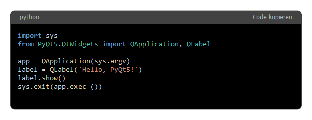

# PyQT5-Codebox

**CodeBox** ist eine einfache und leicht zu integrierende Komponente für PyQt5, die es ermöglicht, Code-Snippets in einer grafischen Benutzeroberfläche anzuzeigen. Mit einer integrierten Copy-to-Clipboard-Funktion und Syntax-Highlighting für Python-Code eignet sich CodeBox ideal für Entwickler-Tools und Code-Präsentationen.



## Funktionen

- **Code-Anzeige**: Zeigt Python-Code in einer schön formatierten Code-Box mit passendem Syntax-Highlighting.
- **Copy-to-Clipboard**: Ein Klick auf den Button "Code kopieren" kopiert den gesamten Code in die Zwischenablage.
- **Automatische Größenanpassung**: Die Höhe der Code-Box passt sich dynamisch an den Inhalt an.
- **Einfach integrierbar**: Verwende die CodeBox-Komponente einfach in deiner PyQt5-Anwendung mit einer einzigen Funktion.

## Installation

Du kannst **CodeBox** ganz einfach über `pip` installieren:

```bash
pip install codebox
